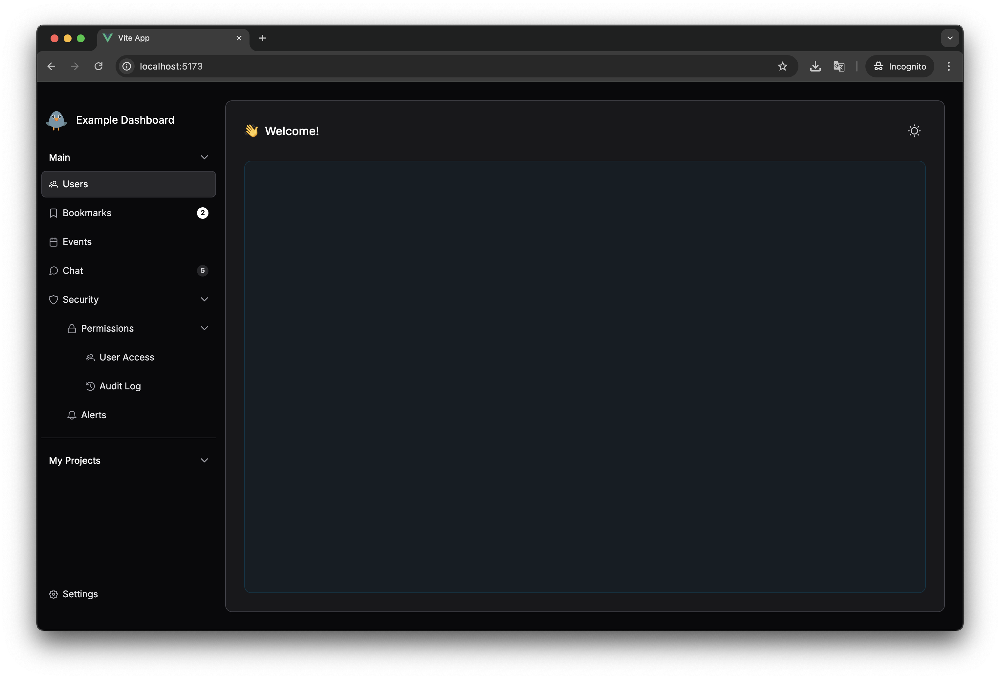

# Example Dashboard 

A starter project for quickly creating modern dashboards and admin panels using Vue 3, PrimeVue, and Tailwind CSS.




## 🚀 Features

- 📎 Modern UI based on [PrimeVue](https://primevue.org/)
- 🎨 Customizable components with light and dark theme support
- 📱 Responsive design for desktop and mobile devices
- 🧩 Ready-to-use layout templates and components
- 🔄 Smooth animations and transitions
- 🛠️ Tailwind CSS integration for flexible styling

## 🛠️ Tech Stack

- **Vue 3** - progressive JavaScript framework
- **Vite** - fast build tool
- **Tailwind CSS 3** - utility-first CSS framework
- **Inter** - modern font
- **PrimeVue 4** - UI component library
- **PrimeIcons** - icon set

## 🔧 Development Setup

```bash
# Clone the repository
git clone https://github.com/MariaPaypoint/example-dashboard.git
cd example-dashboard

# Install dependencies
npm install

# Start development server
npm run dev
```

## 📦 Production Build

```bash
npm run build
```

Built files will be placed in the `dist` directory.

## 🧩 Project Structure

```
├── public/                # Static files
├── src/
│   ├── assets/            # Styles and resources
│   ├── components/        # Vue components
│   │   └── BaseLayout.vue # Dashboard skeleton (menu and general layout)
│   ├── App.vue            # Root component
│   └── main.js            # Entry point
├── index.html             # HTML template
└── tailwind.config.js     # Tailwind CSS configuration
```

## 📚 Documentation

- [Vue 3](https://v3.vuejs.org/)
- [Tailwind CSS](https://tailwindcss.com/)
- [PrimeVue](https://primevue.org/)
