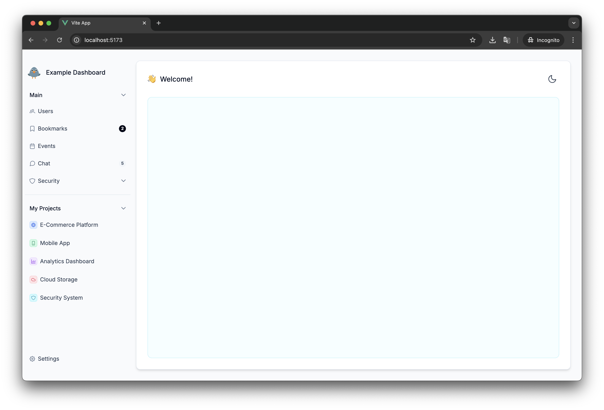

# Bible Dashboard

A modern web application for analyzing Bible forced alignments data. Built with Vue 3, PrimeVue, and Tailwind CSS, this dashboard provides comprehensive tools for managing and analyzing voice data and anomalies in Bible translations.



## 🚀 Features

### Core Functionality
- 🎤 **Voice Management** - Browse and manage Bible voice data with advanced filtering
- ⚠️ **Anomaly Detection** - View and analyze forced alignment anomalies
- 🔍 **Advanced Search** - Filter voices by code and alias simultaneously
- 📊 **Data Tables** - Sortable and filterable data presentation
- 🌐 **Multi-language Support** - Handle multiple Bible translations

### UI/UX Features
- 📎 Modern UI based on [PrimeVue](https://primevue.org/)
- 🎨 Light and dark theme support with smooth transitions
- 📱 Fully responsive design for desktop and mobile devices
- 🧭 Dynamic navigation with contextual headers
- 🔧 Fixed sidebar with always-visible settings
- ⚡ Optimized scrolling - sidebar stays fixed, content scrolls independently

## 🛠️ Tech Stack

### Frontend
- **Vue 3** - Progressive JavaScript framework with Composition API
- **TypeScript** - Type-safe JavaScript development
- **Vite** - Fast build tool and development server
- **Tailwind CSS 3** - Utility-first CSS framework
- **PrimeVue 4** - Comprehensive UI component library
- **PrimeIcons** - Icon set for modern interfaces

### Data & API
- **Custom Composables** - Reusable logic for translations, languages, and API calls
- **RESTful API Integration** - Seamless data fetching and management
- **Reactive State Management** - Vue 3 reactivity system

## 🔧 Development Setup

```bash
# Clone the repository
git clone <repository-url>
cd bible-dashboard

# Install dependencies
npm install

# Start development server
npm run dev
```

The application will be available at `http://localhost:5173`

## 📦 Production Build

```bash
npm run build
```

Built files will be placed in the `dist` directory.

## 🧩 Project Structure

```
├── public/                    # Static files and assets
├── src/
│   ├── assets/                # Images, logos, and static resources
│   ├── Components/            # Vue components
│   │   ├── BaseLayout.vue     # Main layout with sidebar and navigation
│   │   ├── BibleVoices.vue    # Voice data management interface
│   │   ├── BibleAnomalies.vue # Anomaly detection and analysis
│   │   └── Welcome.vue        # Dashboard welcome screen
│   ├── composables/           # Reusable composition functions
│   │   ├── useApi.ts          # API integration utilities
│   │   ├── useTranslations.ts # Translation data management
│   │   └── useLanguages.ts    # Language data handling
│   ├── App.vue                # Root application component
│   └── main.ts                # Application entry point
├── index.html                 # HTML template
├── tailwind.config.js         # Tailwind CSS configuration
├── tsconfig.json              # TypeScript configuration
└── vite.config.ts             # Vite build configuration
```

## 📋 Key Components

### 🎤 Voices Management
- **Advanced Filtering**: Search voices by code and alias simultaneously
- **Multi-column Sorting**: Sort by language, translation, name, code, or alias
- **Pagination**: Configurable rows per page (15, 50, 100)
- **Active Status Toggle**: Filter active/inactive voices
- **Bulk Operations**: Activate/deactivate multiple voices

### ⚠️ Anomaly Detection
- **Comprehensive Analysis**: View forced alignment anomalies across translations
- **Reference Tracking**: Track specific Bible references with anomalies
- **Ratio Analysis**: Analyze anomaly ratios and patterns
- **Filterable Data**: Search and filter anomalies by various criteria
- **Export Capabilities**: Export anomaly data for further analysis

### 🧭 Navigation & UX
- **Fixed Sidebar**: Always-visible navigation with Settings access
- **Dynamic Headers**: Context-aware page titles and icons
- **Responsive Design**: Optimized for desktop and mobile devices
- **Dark/Light Theme**: Seamless theme switching with persistence
- **Optimized Scrolling**: Independent content scrolling for better UX

## 🔧 Technical Features

### Performance Optimizations
- **Lazy Loading**: Components loaded on demand
- **Reactive Filtering**: Real-time data filtering without API calls
- **Computed Properties**: Efficient data transformations
- **Memory Management**: Optimized state management

### API Integration
- **RESTful Endpoints**: Clean API integration
- **Error Handling**: Comprehensive error management
- **Loading States**: User-friendly loading indicators
- **Data Caching**: Efficient data retrieval and caching

## 📚 Documentation

- [Vue 3](https://v3.vuejs.org/)
- [Tailwind CSS](https://tailwindcss.com/)
- [PrimeVue](https://primevue.org/)
- [TypeScript](https://www.typescriptlang.org/)
- [Vite](https://vitejs.dev/)
